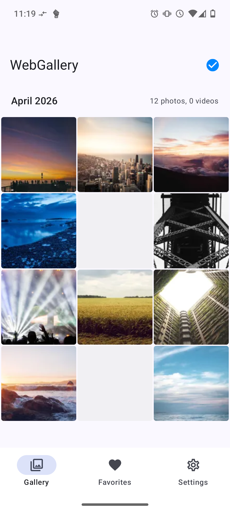
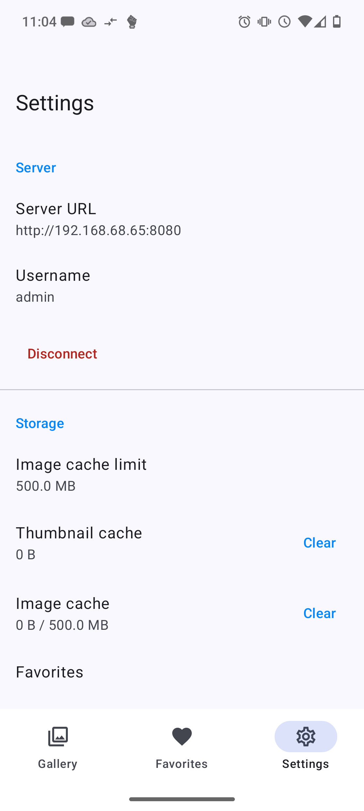
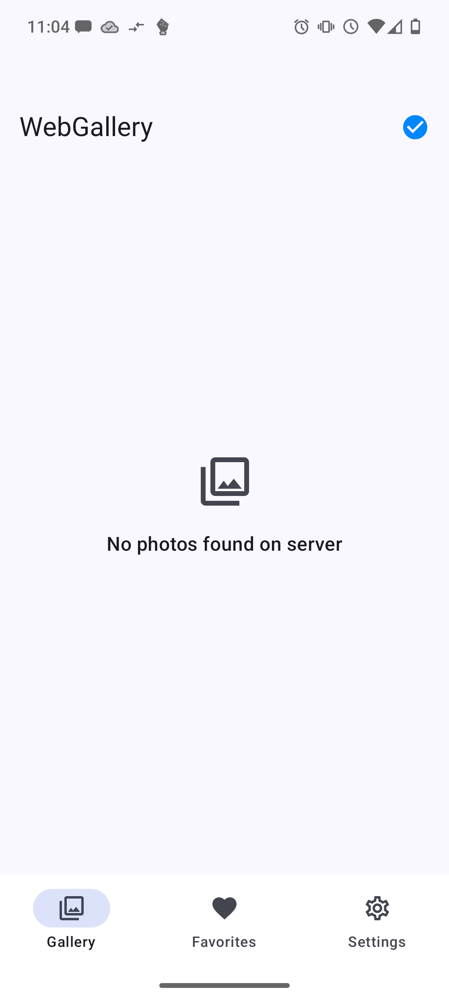
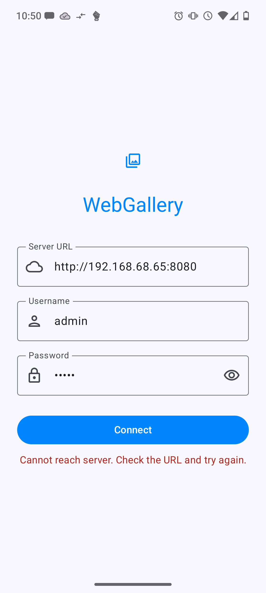

# WebGallery

<p align="center">
  
</p>

<p align="center">
  A private, self-hosted photo gallery for Android.<br/>
  Browse, sync, and manage your photos and videos over WebDAV.
</p>

<p align="center">
  <a href="https://github.com/kiedanski/webgallery/releases/latest"></a>
  <a href="https://github.com/kiedanski/webgallery/actions"></a>
  
  
</p>

---

WebGallery is a companion app for [Tilde](https://github.com/kiedanski/tilde), a personal cloud server. It connects to your Tilde instance over WebDAV and gives you a fast, native gallery experience on your phone — with offline support, background sync, and zero reliance on proprietary services.

## Screenshots

<p align="center">
  
  
  
  
</p>

## Features

**Gallery**
- Browse thumbnails organized by year and month
- Year timeline scrubber for fast navigation across large libraries
- Full-resolution photo viewer with pinch-to-zoom and swipe navigation
- Video streaming with Media3 (ExoPlayer)

**Sync**
- Background sync with foreground service and progress notification
- ETag-based incremental sync — only fetches changes, handles 100k+ photo libraries
- Efficient batched database operations and parallel downloads
- Cancel sync anytime from the notification

**Organize**
- Mark photos as favorites for permanent offline access
- Flag photos for inspection with error diagnostics
- Change photo dates (EXIF modification, server auto-reorganizes)
- Add and edit tags via WebDAV PROPPATCH
- Delete photos (moved to server trash)
- All edits go through an offline mutation queue — works without connectivity

**Upload**
- Watch folders on your phone (Camera, WhatsApp, Screenshots, or any custom folder)
- Auto-upload new photos/videos to your Tilde server
- Browse watched folder contents with upload status overlays
- Configurable: WiFi-only, delete after upload, per-folder settings
- Background periodic scanning via WorkManager

**Design**
- Material 3 with light/dark/system theming
- Zero proprietary dependencies — fully F-Droid compatible
- Credentials encrypted with AES-256-GCM
- GPLv3 licensed

## Requirements

- Android 8.0 (API 26) or newer
- A reachable [Tilde](https://github.com/kiedanski/tilde) server with WebDAV enabled
- Server-generated thumbnails under `_thumbnails/{year}/{month}/`

## Install

**From GitHub Releases:**

Download the latest APK from the [Releases page](https://github.com/kiedanski/webgallery/releases/latest).

**Build from source:**

```bash
./gradlew :app:assembleDebug
```

Requires JDK 17 and Android SDK with platform 35.

## Documentation

Full documentation is available at **[kiedanski.github.io/webgallery](https://kiedanski.github.io/webgallery)**.

## Architecture

```
webgallery/
  core/          # Pure Kotlin module — WebDAV client, models, utilities
  app/           # Android app — UI, database, sync services
    data/        # Repository, cache, EXIF editor, mutation processor
    data/db/     # Room entities and DAOs
    sync/        # Foreground services (SyncService, UploadService)
    ui/          # Jetpack Compose screens
```

## Contributing

Contributions are welcome! Please open an issue first to discuss what you'd like to change.

## License

[GNU General Public License v3.0](https://www.gnu.org/licenses/gpl-3.0.html)
